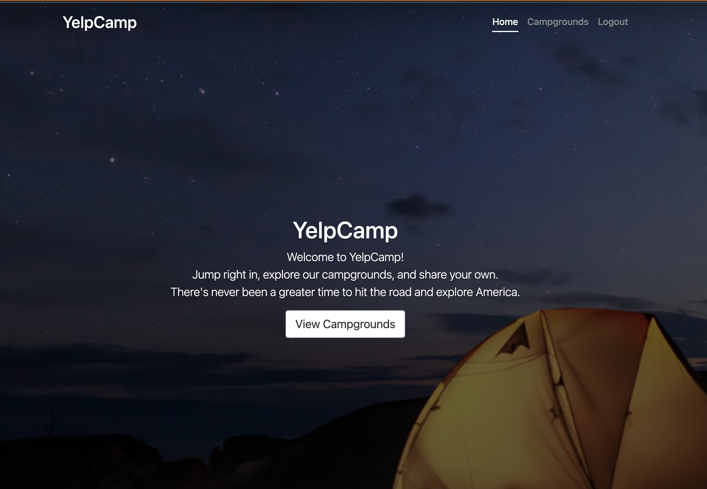

# YelpCamp 

> YelpCamp is a dynamic multi-page web app utilizing server-side rendering and data persistence.
> Live demo [_here_](https://cryptic-falls-28870.herokuapp.com/).

## Table of Contents 

* [General Information](#general-information)
* [Technologies](#technologies)
* [Features](#features)
* [Screenshots](#screenshots)
* [Setup](#setup)
* [Usage](#usage)
* [Project Status](#project-status)
* [Future Development](#future-development)
* [Acknowledgements](#acknowledgements)
* [Contact](#contact)
* [License](#license)

## General Information
- General info about project
- purpose of project
- What was your motivation?
- Why did you build this project?
- What problem does it solve?
- What did you learn?
- What makes your project stand out?
- What features does it have?
- Challenges
- Scope of functionalities 

## Technologies:
The following technologies were used in building this web app: 

- HTML/CSS
- JavaScript
- Bootstrap(version): for front-end styling purposes
- EJS
- MongoDB
- MapBox

## Features
- YelpCamp utilizes server-side rendering and data persistence with MongoDB in order for app users to read, create, edit, and delete a database of campgrounds around America. 
- The goal of this app is to provide a community resource for users in order to help people find, rate, and add campgrounds.  The hope is that more people would enjoy camping in beautiful camping locations.

## Screenshots

## Setup
- Project requirements/dependencies
- Where are they listed? Where is this located?
- Describe how to install / set up local enviroment to get started with project
- Fork project
- Download dependencies:
- minimum hardware reqs?
- input data? what format?
- Examples 
- Screenshots
- Structure/Design principles utilized
- Authentication: passwords/usernames 

## Usage
- How does one start using project?
- Various use cases and code examples
- tests?

`write-your-code-here`

## Project Status
This YelpCamp project is: _in progress_.

## Future Development
Room for Improvement:
- Refactor code
- Move Helmet into separate file

Possible New Features:
- [ ] Dark Mode
- [ ] Move Helmet (Express.js security with HTTP headers) into separate file

## Acknowledgements 
- This web app project was based on the tuturial in [The Web Developer Bootcamp 2022](https://www.udemy.com/course/the-web-developer-bootcamp/).
- Many thanks to Colt Steele, his team, and Udemy

## Contact
Created by [Paul Daniel Przybylowski](https://paulprzybylowski.github.io)

## License 
This project is open source and available under the [MIT License](https://github.com/git/git-scm.com/blob/main/MIT-LICENSE.txt).

